# Airflow + dbt on EC2 with Terraform

This repository contains infrastructure as code (IaC) to deploy Apache Airflow with dbt (data build tool) on an AWS EC2 instance using Terraform. The setup uses Docker Compose to run Airflow and includes automatic synchronization of DAGs and dbt projects from S3.

## Architecture Diagram

```mermaid
flowchart LR
   
    TF[🔧 Terraform]
    TF -->|Deploy| EC2[☁️ EC2 + Airflow]
    TF -->|Upload| S3[📦 S3 Bucket]
    
    S3 -->|Sync every 30s| EC2
    EC2 -->|Execute dbt| ATHENA[🔍 Athena]
    ATHENA -->|Query| DATA[💾 S3 Data Lake]
    
    EC2 -.->|Access UI :8080| DEVELOPER

    classDef awsService fill:#FF9900,stroke:#232F3E,stroke-width:2px,color:#fff
    classDef devService fill:#4A90E2,stroke:#2E5C8A,stroke-width:2px,color:#fff
    
    class S3,EC2,ATHENA,DATA awsService
    class DEVELOPER,TF devService
```


## Architecture Overview

- **EC2 Instance**: Runs Airflow using Docker Compose
- **S3 Bucket**: Stores Airflow DAGs and dbt project files
- **IAM Roles**: Provides EC2 instance with necessary AWS permissions
- **Security Groups**: Controls network access to the Airflow instance
- **Automated Sync**: Cron jobs sync DAGs and dbt files from S3 every 30 seconds

## Components

### Airflow Setup
- Custom Docker image with Airflow + dbt pre-installed
- Astronomer Cosmos for dbt integration
- Automatic DAG parsing and execution
- Web UI accessible on port 8080

### dbt Integration
- Cosmos DbtDag for Airflow-native dbt orchestration
- Configured for Athena with Iceberg table format
- Incremental materialization strategy
- Staging and marts data models

### Infrastructure
- **Terraform Modules**:
  - `airflow`: EC2 instance, IAM roles, S3 bucket setup
  - `upload`: Uploads DAGs and dbt files to S3
  - `lambda`: (Commented out) For triggering Airflow DAGs

## Prerequisites

- AWS CLI configured with appropriate credentials
- Terraform >= 1.0
- AWS account with permissions to create EC2, S3, IAM resources
- dbt project files in `/dbt` directory
- Airflow DAGs in `/dags` directory

## Quick Start

### Initialize and Deploy

```bash
# Initialize Terraform
terraform -chdir=terraform/ init

# Review the execution plan
terraform -chdir=terraform/ plan

# Deploy the infrastructure
terraform -chdir=terraform/ apply -auto-approve
```

### Access Airflow UI

After deployment, Terraform outputs the EC2 public DNS. Access the Airflow UI at:

```
http://<EC2_PUBLIC_IP>:8080
```

**Default Credentials:**
- Username: `airflow`
- Password: `airflow`

### View Outputs

```bash
terraform -chdir=terraform/ output
```

## File Structure

```
.
├── dags/                          # Airflow DAG files
│   └── dbt_version_test.py       # Example dbt DAG using Cosmos
├── dbt/                           # dbt project files
│   ├── dbt_project.yml           # dbt project configuration
│   ├── profiles.yml              # dbt connection profiles
│   ├── models/                   # dbt data models
│   └── seeds/                    # dbt seed data
├── terraform/                     # Terraform infrastructure code
│   ├── main.tf                   # Main Terraform configuration
│   ├── modules/
│   │   ├── airflow/              # Airflow EC2 module
│   │   │   ├── airflow.tf
│   │   │   ├── user_data.sh      # EC2 initialization script
│   │   │   ├── Dockerfile        # Custom Airflow image
│   │   │   └── docker-compose.yaml
│   │   └── upload/               # S3 upload module
│   └── variables.tf
└── ReadMe.md
```

## Key Features

### Automatic Synchronization
- DAGs and dbt files are automatically synced from S3 to the EC2 instance every 30 seconds
- Changes to local files require uploading to S3 (handled by the `upload` module)

### dbt with Cosmos
- Uses Astronomer Cosmos to convert dbt models into Airflow tasks
- Each dbt model becomes an individual Airflow task
- Maintains dbt's DAG structure within Airflow
- Supports incremental models with Athena and Iceberg

### Custom Docker Image
The Airflow image includes:
- Apache Airflow
- dbt-core and dbt-athena-adapter
- Astronomer Cosmos
- AWS CLI and boto3

## Configuration

### Customizing the Deployment

Edit `terraform/variables.tf` or create a `terraform.tfvars` file to customize:
- Instance type
- Region
- AMI
- Resource naming prefix

### dbt Configuration

The dbt project is configured in `dbt/dbt_project.yml`:
- Incremental materialization
- Iceberg table format
- Insert-overwrite strategy
- Staging and marts layers

### Airflow DAG Configuration

Example DAG (`dags/dbt_version_test.py`) shows:
- Cosmos DbtDag configuration
- Athena profile setup
- Local execution mode
- OpenLineage disabled

## Cleanup

To destroy all created resources:

```bash
terraform -chdir=terraform/ destroy -auto-approve
```

## Troubleshooting

### Check EC2 Bootstrap Logs
```bash
# SSH into the instance
ssh -i airflow-poc-key.pem ubuntu@<EC2_PUBLIC_IP>

# Monitor initialisation logs
tail -f /var/log/cloud-init-output.log
```

### Check EC2 Instance Logs
```bash
# SSH into the instance
ssh -i airflow-poc-key.pem ubuntu@<EC2_PUBLIC_IP>

# View Docker logs
sudo docker-compose -f /opt/airflow/docker-compose.yaml logs

# View sync logs
sudo tail -f /var/log/airflow-dag-sync.log
sudo tail -f /var/log/airflow-dbt-sync.log
```

### Common Issues
- **DAGs not appearing**: Check S3 sync logs and ensure files are uploaded to S3
- **dbt connection errors**: Verify Athena credentials and S3 bucket permissions
- **Airflow not starting**: Check Docker logs and ensure EC2 instance has enough resources

## References

- [Astronomer Cosmos Documentation](https://astronomer.github.io/astronomer-cosmos/)
- [dbt Documentation](https://docs.getdbt.com/)
- [Apache Airflow Documentation](https://airflow.apache.org/docs/)
- [Setup Reference](https://github.com/hitchon1/setup-airflow-ec2)
